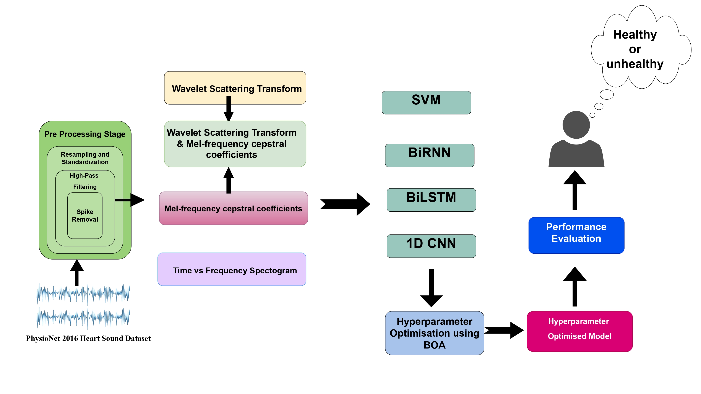
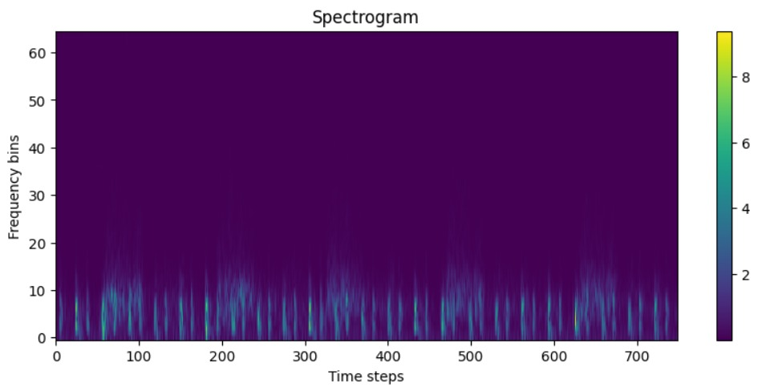

# Butterfly Optimization and Deep Learning to Classify Heart Sound Signal

## Abstract
Heart sound signals, or PCG recordings, provide a valuable non-invasive alternative to traditional diagnostic methods like CXR and blood tests for detecting cardiovascular disease. In this study, PCG data are collected, and features such as MFCC and WST are extracted to capture both time and frequency information. These features are used to classify the signals into normal and abnormal categories using DL models, including CNN, Bi-LSTM, and Bi-RNN. The study conducts extensive experiments using individual and combined features, showing that combining features enhances classification accuracy. The proposed CNN model, optimized with the Butterfly Optimization Algorithm, achieves an impressive classification accuracy of 99.07\%, outperforming other models. This result highlights the effectiveness of using PCG signals and advanced DL techniques for accurate cardiovascular disease detection, offering a non-invasive and efficient alternative for early diagnosis.
## Table of Contents
- [Dataset](#dataset)
- [Methodology](#methodology)
- [Feature Extraction](#feature-extraction)
- [Results](#results)
- [Hyperperemeter Optimization](#hyperperemeter-optimization)
- [Contact Information](#contact-information)
- [Citation](#citation)
- [License](#license)

## Dataset

The dataset which is utilized in this investigation originates from the PhysioNet/CinC Challenge 2016 which includes 3,240 phonocardiograms (PCG) records that have been organized into five different databases which are labeled A through E. You can find the dataset <a href="https://archive.physionet.org/pn3/challenge/2016/">here</a>.

## Methodology

## Feature Extraction

- **Wavelet Scattering Transform (WST):**
  - Extracts first-order scattering coefficients for cardiac signal analysis.
  - Preprocessing includes normalization, resampling to 2 kHz, and standardization.

- **MFCC Features:**
  - Captures 7 coefficients from phonocardiogram recordings.
  - Preprocessed to 30,000 samples (15 seconds) at a 2 kHz rate.

- **Spectrogram Features:**
  - Generated via STFT with 80-frame window, 40-sample step size.
  - Normalized amplitude for uniform input to ML models.

- **Combined Features (MFCC + WST):**
  - Integrated spectral and invariant feature representations.
  - Formatted in 3D for DL/ML compatibility.

- **Model Applications:**
  - **SVM**: Linear kernel applied on 3D data, 42 random states tested.
  - **CNN**: 16-32 filter convolutional layers, ReLU activation, sigmoid output.
  - **Bi-LSTM & Bi-RNN**: 64-neuron dense layer, trained with binary cross-entropy loss.

- **Optimizer & Training:**
  - Adam optimizer, \(1 \times 10^{-4}\) learning rate.
  - Batch size: 16, Epochs: 100.

## Results

### Table 1: Performance Evaluation of Different Feature Types

| **Feature Type**                   | **Model**  | **Accuracy** | **Precision** | **Recall** | **F1 Score** |
|------------------------------------|------------|--------------|---------------|------------|--------------|
| **Wavelet Scattering Coefficient** | CNN        | 0.95         | 0.94          | 0.97       | 0.95         |
|                                    | BiLSTM     | 0.93         | 0.93          | 0.89       | 0.91         |
|                                    | BiRNN      | 0.94         | 0.92          | 0.98       | 0.95         |
|                                    | SVM        | 0.85         | 0.87          | 0.96       | 0.91         |
| **MFCC Spectrum**                  | CNN        | 0.96         | 1.00          | 0.92       | 0.96         |
|                                    | BiLSTM     | 0.95         | 0.95          | 0.94       | 0.94         |
|                                    | BiRNN      | 0.95         | 0.99          | 0.91       | 0.95         |
|                                    | SVM        | 0.89         | 0.96          | 0.90       | 0.93         |
| **Spectrogram**                    | CNN        | 0.98         | 0.97          | 1.00       | 0.98         |
|                                    | BiLSTM     | 0.94         | 0.95          | 0.92       | 0.94         |
|                                    | BiRNN      | 0.94         | 0.92          | 0.95       | 0.93         |
|                                    | SVM        | 0.82         | 0.88          | 0.88       | 0.88         |

### Table 2: Performance Evaluation of the Proposed Method

| Feature Type                         | Model       | Accuracy | Precision | Recall | F1 Score |
|--------------------------------------|-------------|----------|-----------|--------|----------|
| **Combined Feature (WST and MFCC)**  | CNN (With BOA) | 0.99     | 0.99      | 0.99   | 0.99  |
|                                      | BiLSTM      | 0.98     | 0.97      | 0.99   | 0.98     |
|                                      | BiRNN       | 0.96     | 0.95      | 0.95   | 0.95     |
|                                      | SVM         | 0.91     | 0.92      | 0.97   | 0.95     |

## Hyperparameter Optimization

### Hyperparameter Optimization using Butterfly Optimization Algorithm (BOA)

- **Overview**:
  - BOA is used to optimize CNN hyperparameters for classifying phonocardiogram signals.
  - Inspired by the sensory mechanisms of butterflies to find food and mates using fragrance.

- **Fragrance Calculation**:
  \[
  f = cI^a
  \]
  - \( c \): Sensory modality.
  - \( I \): Stimulus intensity.
  - \( a \): Power exponent dependent on modality.

- **Movement Calculation** (Global Search Phase):
  \[
  x_{i}^{(t+1)} = x_{i}^{(t)} + r^2 \times (g^* - x_{i}^{(t)}) \times f_i
  \]
  - \( x_{i}^{(t)} \): Position of the \( i \)-th butterfly at iteration \( t \).
  - \( g^* \): Best solution found so far.
  - \( f_i \): Fragrance value.
  - \( r \): Random number in [0, 1].

- **Key Optimized Hyperparameters**:
  - Convolutional layers: 32 and 16 filters.
  - Learning rate: \( 0.0001 \).
  - Strides: [2,2].
  - Dense layer: 128 units.
  - Epochs: 100.
  - Batch size: 16.

- **Results**:
  - Enhanced model accuracy for distinguishing physiological and pathological cardiac sounds.
  - Demonstrated the effectiveness of nature-inspired algorithms in clinical diagnostics.

## Contact Information

For any questions or further inquiries, please feel free to reach out:

- **Shuvashis Sarkar**
  - Email: [shuvashisofficial@gmail.com](mailto:shuvashisofficial@gmail.com)
  - **Faika Fairuj Preotee**
  - Email: [faikafairuj2001@gmail.com](mailto:faikafairuj2001@gmail.com)
  - **Md Sabbir Hossain**
  - Email: [mdsabbir120834@gmail.com](mailto:mdsabbir120834@gmail.com)
  - **Farliha Binte Faisal**
  - Email: [farliha1722,@gmail.com](mailto:farliha1722,@gmail.com)
    
## Citation

If you find the research work helpful, please consider citing our paper:

## License
[MIT License](LICENSE)
